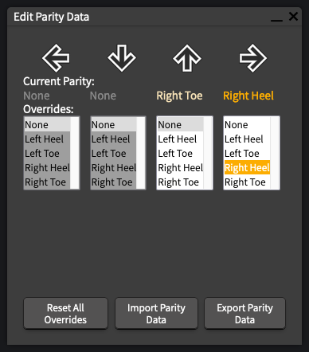
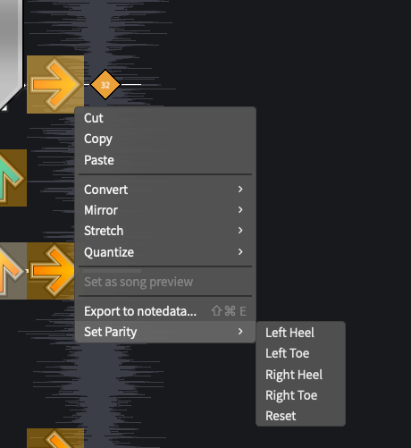
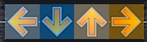
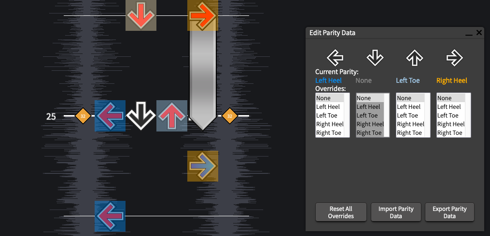
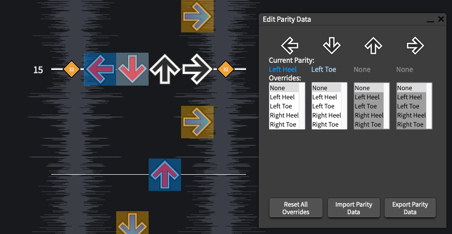

# Using the Parity Editor

After you've opened a stepchart to edit, select `Chart > Edit Parity Data`, or press `alt+shift+P` to open the Edity Parity Data window.

This window shows you the current parity settings for the current beat.

 - Current Parity:
    
   This is the current parity setting for the given column.
- Overrides:

  This displays what override has been chosen (if any) for a column. Selecting a value will update the chart and the `Current Parity` setting above.

- Reset All Overrides

  This will clear the _entire chart_ of any parity overrides.

- Import Parity Data

  This will open a small textarea for you to paste JSON into (dealing with file uploading is slightly nontrivial, and I didn't feel like implementing that right now)

- Save Parity Data

  This will save the parity data for the given stepchart to JSON, named "[song title]-[difficulty]-parity.json"

- Save Node Data
  
  This will save a json file that contains several parts. Please send these to me.

Besides this window, you can also edit the parity for any note using the context menu. Just right click the note, and select `Set Parity`:

## Some Things to Know
The colors being used are:
- Left Heel = darker blue
- Left Toe = lighter blue
- Right Heel = darker orange
- Right Toe = lighter orange

Rows that have had their parity manually changed will have a red line on the bottom:

## Known Issues

- When a hold note ends on the same row as other notes, it will show up as selectable in the Edit Parity Data window. This is a quirk with how the parity data is stored (the hold note is relevant to how the other notes are hit). 

- Brackets that include the down arrow are almost always given a backwards parity (eg for LD, it will suggest using left heel and left toe, respectively). For the most part, this doesn't create any problems, it's just technically not correct.

- For single notes, this will always choose either "Left Heel" or "Right Heel". No effort is made to decide which part of the foot would be most "correct", it's more just a placeholder for "you'd use some part of your left foot to hit this note".
